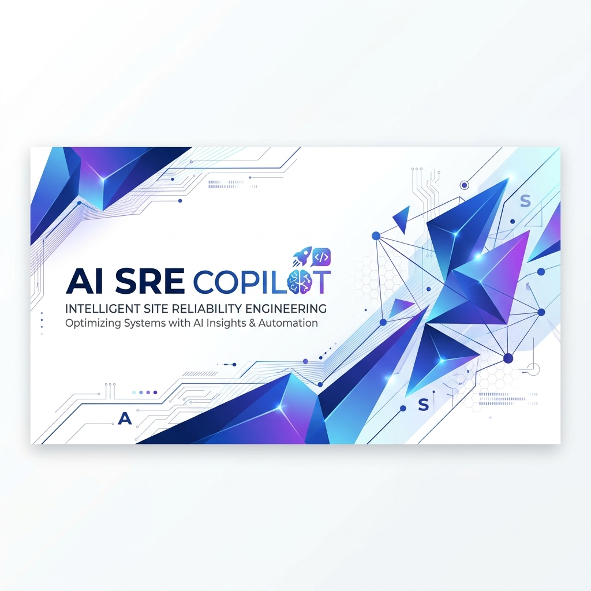
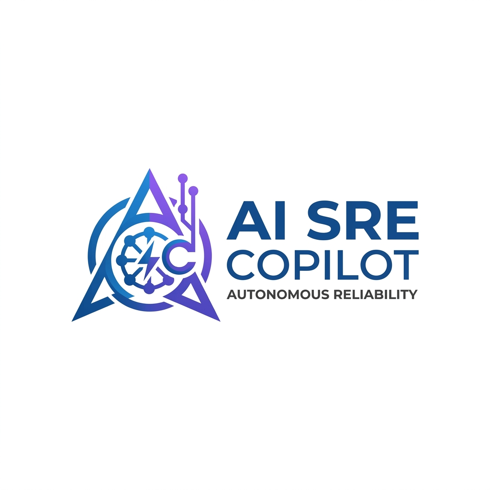
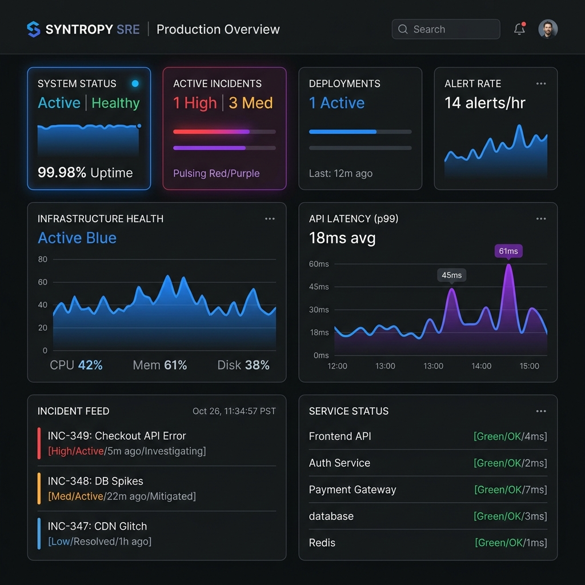
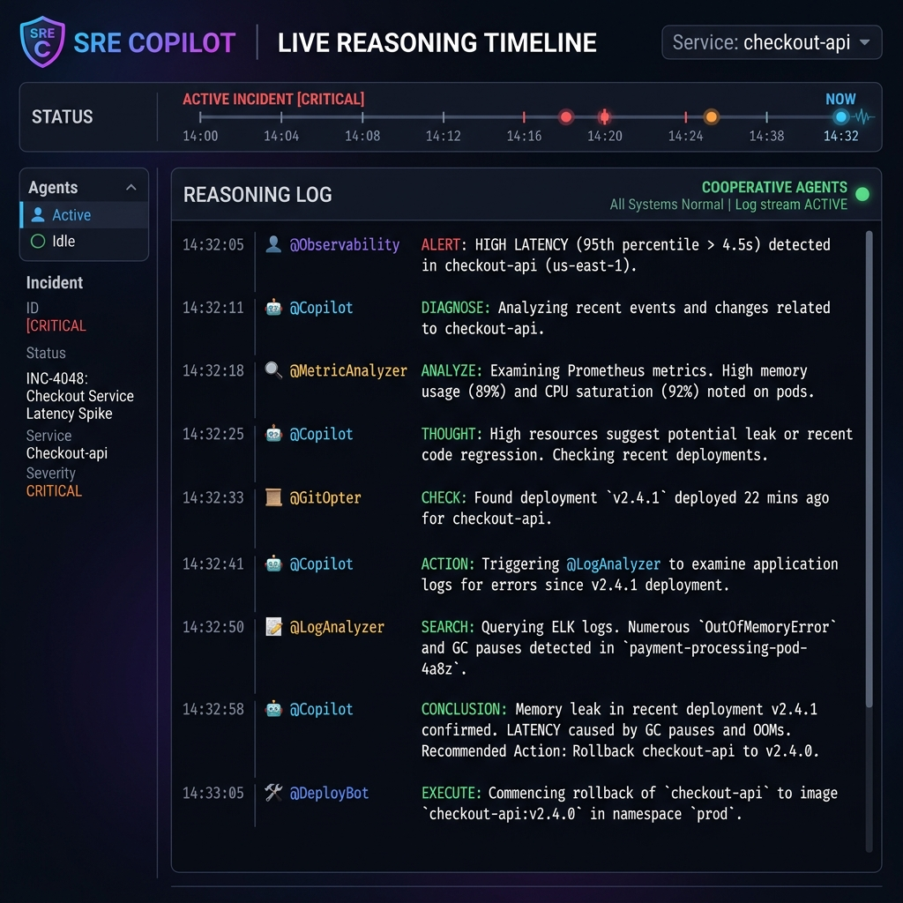
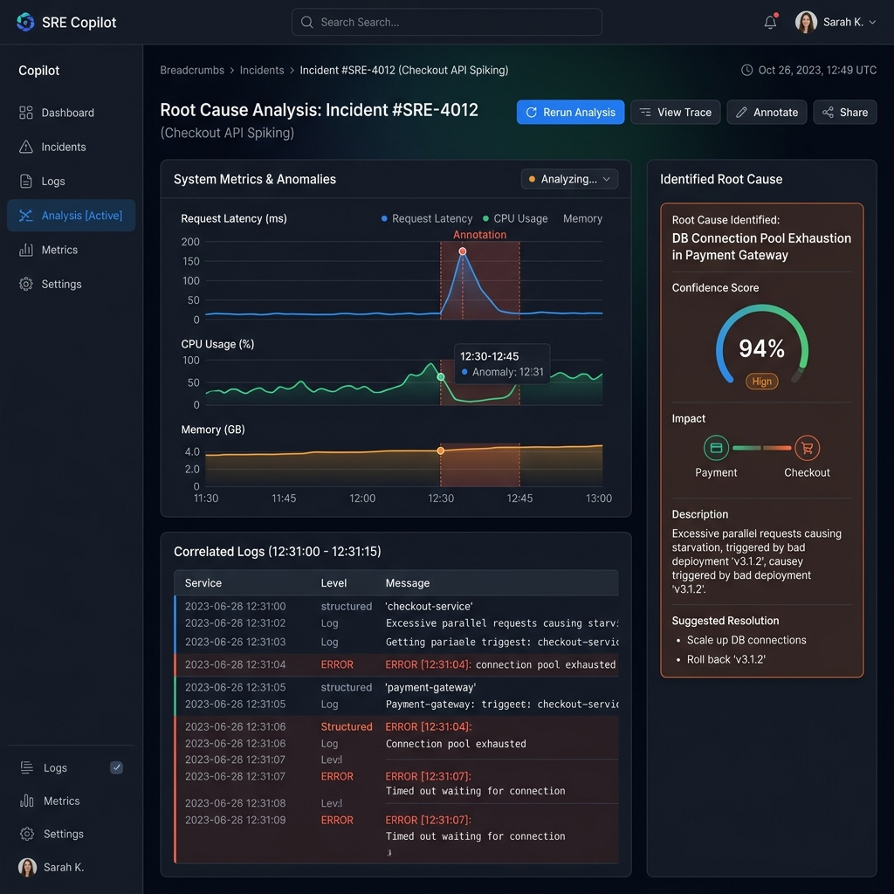
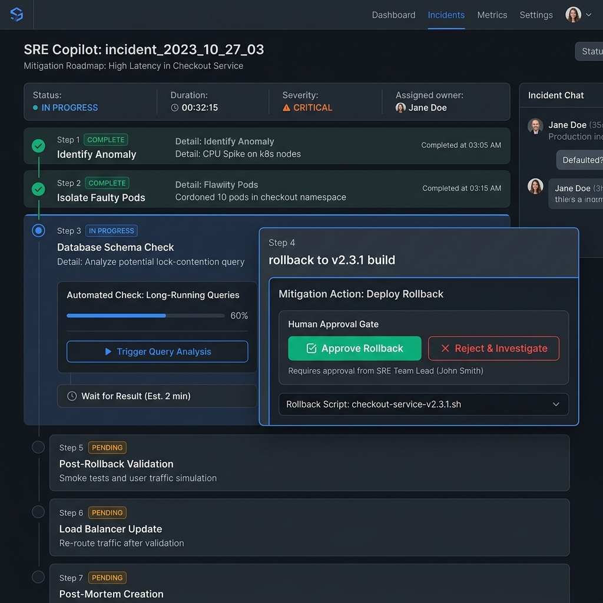

# AI SRE Copilot

<p align="center">
  
</p>

<p align="center">
  
</p>

<p align="center">
  <strong>An Autonomous Cooperative Multi-Agent Incident Response & SRE Observability Platform</strong>
</p>

<p align="center">
  <a href="https://github.com/Sanjeev12588/ai-sre-copilot/actions/workflows/ci.yml">
    
  </a>
  
  
  
  
  
  
  
</p>

---

## What is AI SRE Copilot?

**AI SRE Copilot** is a state-of-the-art, autonomous, cooperative multi-agent SRE incident resolution platform. It ingests system alerts, Triages impact, analyzes application logs, deduces root causes, formulates step-by-step mitigation plans (with manual approval gates), and executes recovery scripts—all within a highly secured API Gateway.

### Which Problem it Solves
Traditional SRE automation is rigid, relying on hardcoded scripts and static rules that fail during complex, multi-system cascading failures. Human SRE operators are often fatigued by alert noise and high MTTR (Mean Time To Resolution). AI SRE Copilot solves this by automating the diagnostic reasoning and remediation workflow, cutting MTTR from hours to minutes.

### Why AI Agents?
Cascading failures require cognitive adaptability. SRE Copilot delegates specific investigations to **8 specialized SRE agents** (e.g. log analysis, root cause deduction, validation check). Rather than using a single monolithic LLM prompt (which suffers from context fatigue and hallucinations), these agents coordinate dynamically, yielding structured, predictable SRE operations.

### Why Google ADK?
We chose **Google's Agent Development Kit (ADK)** because of its native support for hierarchical coordination, strict schema validation, and smooth integration with Gemini models. It provides a robust framework for agent lifecycles, structured outputs, and telemetry tracing.

### Why Model Context Protocol (MCP)?
To separate the agent's reasoning from target server execution, we leverage the **Model Context Protocol (MCP)**. This separates the agent's logic from direct SSH/API execution. Agents query infrastructure tools (like tailing logs or rollback actions) over a secure JSON-RPC interface handled by independent, decoupled MCP servers.

---

## Key Features

- **Cooperative Multi-Agent SRE Engine**: Powered by Google ADK and Gemini, utilizing 8 specialized agent roles.
- **Vibrant SRE Dashboard**: Datadog-style UI featuring widgets, live terminal timelines, visual agent flow executions, and alert simulators.
- **Secured API Gateway**: Hardened FastAPI router containing IP rate limiting, payload validation, prompt injection detection, and WebSocket boundaries.
- **Model Context Protocol (MCP) servers**: Decoupled tool servers managing metric reading and Docker container management.
- **Hash-chained Audit Trail**: A tamper-evident JSONL security log registering every sensitive API request, WebSocket event, and tool invocation.
- **Automated Post-Mortem Generator**: Generates comprehensive, standardized Markdown post-mortem reports.

---

## System Architecture

The SRE Copilot architecture is fully decoupled, isolating views, API gateway processing, cognitive orchestration, and target environment tools.

<p align="center">
  
</p>

For a detailed deep-dive of the system architecture, event flows, and lifecycle rules, see our [Architecture Documentation](docs/architecture/overview.md).

---

## UI Screenshots

### 1. SRE Observability Mission Control Dashboard
Renders active incident grids, alert simulators, and system health status.
<p align="center">
  
</p>

### 2. Live Agent reasoning Timeline
Real-time streaming of agent execution steps, diagnostics logs, and thoughts over WebSockets.
<p align="center">
  
</p>

### 3. Root Cause Analysis
Metrics graph correlations, error highlights, and root cause hypothesis verification.
<p align="center">
  
</p>

### 4. Recovery Planner & Manual Approval Gate
Visual step-by-step mitigation roadmap with manual approval triggers for executing rollbacks.
<p align="center">
  
</p>

---

## Security Model

Security is baked directly into the API gateway through a 5-stage pipeline separating untrusted browser clients from the trusted cognitive zone.

<p align="center">
  
</p>

1. **IP Rate Limiting**: Token-bucket sliding window to prevent DoS attacks on alert endpoints.
2. **DTO Validation**: Schema type coercion and field boundary validation via Pydantic.
3. **Prompt Injection Detection**: Anti-injection checks (blacklist filters + structural checks + LLM classifiers).
4. **Audit Trail**: Every transaction is logged to a hash-chained JSONL file to prevent audit log tempering.
5. **Tool Firewall**: Restricts MCP actions to a strict list of safe commands and validated parameters.

---

## Repository Structure

```text
├── .github/                  # CI workflows, PR and Issue templates
├── backend/                  # FastAPI Gateway, SRE Agents, MCP Servers, Security Pipeline
│   ├── api/                  # FastAPI routers, DTO schemas, WebSockets
│   ├── agents/               # Google ADK agent configurations & logic
│   ├── mcp_servers/          # Decoupled MCP tool servers (monitoring & incidents)
│   ├── security/             # Rate limiter, injection detector, audit trail, PII redactor
│   └── persistence/          # JSON Case-File storage engine
├── frontend/                 # React SPA (Vite + TypeScript + vanilla CSS)
├── docs/                     # System architecture SVG diagrams, UI screenshots, design files
├── tests/                    # Comprehensive unit, integration, and contract tests
├── pyproject.toml            # Project metadata and dependencies
└── uv.lock                   # Lockfile for reproducible Python installations
```

---

## Tech Stack

- **Backend**: Python 3.11, FastAPI, Uvicorn, Pydantic, Python-dotenv
- **Frontend**: React 19, TypeScript, Vite, Framer Motion, Vanilla CSS
- **AI / Reasoning**: Google ADK, Google GenAI SDK (Gemini 2.5/3.5)
- **Tooling Interface**: Model Context Protocol (MCP) Standard
- **Testing**: Pytest, Pytest-asyncio, FastAPI TestClient

---

## Installation & Setup

### Prerequisites
- Python 3.11 or higher
- Node.js 22 or higher
- A valid **Gemini API Key** (set as `GEMINI_API_KEY` in your environment)

### 1. Clone the Repository
```bash
git clone https://github.com/Sanjeev12588/ai-sre-copilot.git
cd ai-sre-copilot
```

### 2. Configure Environment Variables
Create a `.env` file in the root directory:
```env
GEMINI_API_KEY="your-gemini-api-key-here"
ENV="development"
PERSISTENCE_DIR="./data/incidents"
AUDIT_LOG_DIR="./data/audit"
```

### 3. Backend Setup
We use `uv` for lightning-fast Python package and environment management.
```bash
# Install uv (if not already installed)
powershell -ExecutionPolicy ByPass -c "irm https://astral.sh/uv/install.ps1 | iex"

# Install python dependencies and create virtual environment
uv sync
```

### 4. Frontend Setup
```bash
cd frontend
npm install
cd ..
```

---

## Running Locally

To run the complete platform, start both the FastAPI backend gateway and the React frontend development server.

### Start the Backend
In your root directory, run:
```bash
uv run uvicorn backend.api.main:app --host 127.0.0.1 --port 8000 --reload
```
The API documentation will be available at `http://127.0.0.1:8000/docs`.

### Start the Frontend
In another terminal, navigate to the `frontend` folder and run:
```bash
cd frontend
npm run dev
```
Open `http://localhost:5173` in your browser to view the Mission Control Dashboard.

---

## Running Tests

Verify code formatting, linting rules, and run all 434 tests using `uv`:

```bash
# 1. Run lint check
uv run ruff check backend tests

# 2. Run format check
uv run ruff format --check backend tests

# 3. Run full test suite
uv run pytest
```

*Note: All tests run offline (using mocks for the Gemini API and MCP processes).*

---

## License

This project is licensed under the MIT License - see the [LICENSE](LICENSE) file for details.

## Acknowledgements

- **Google DeepMind** & the **Kaggle AI Agents Intensive** team for organizing this capstone challenge.
- The open-source SRE community for defining incident post-mortem standards.
