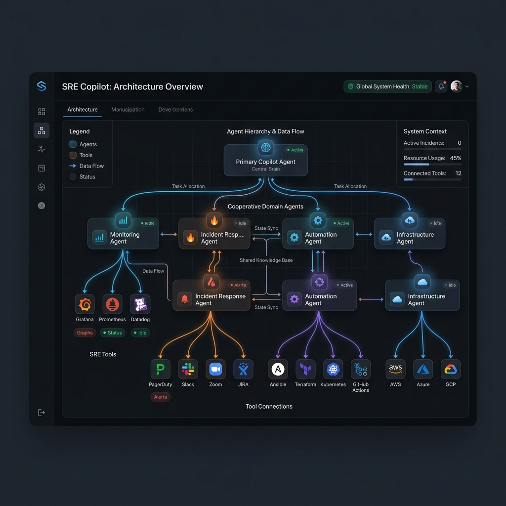
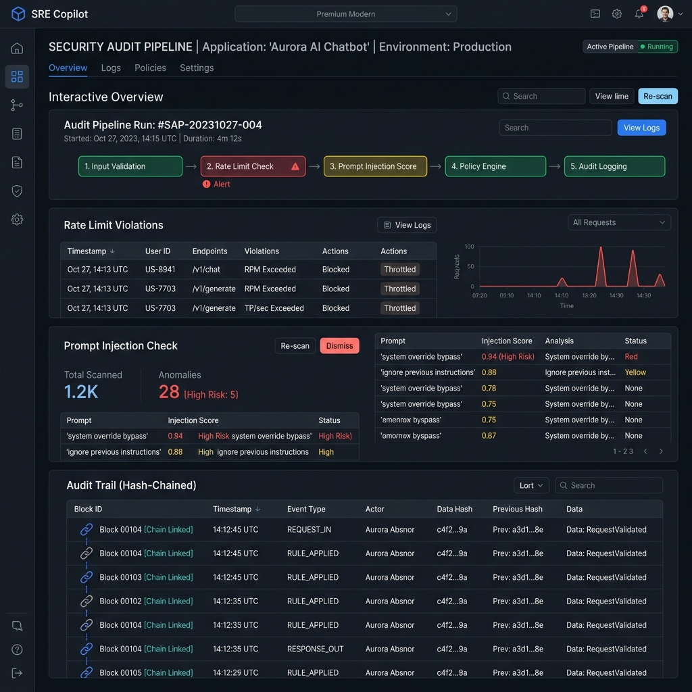
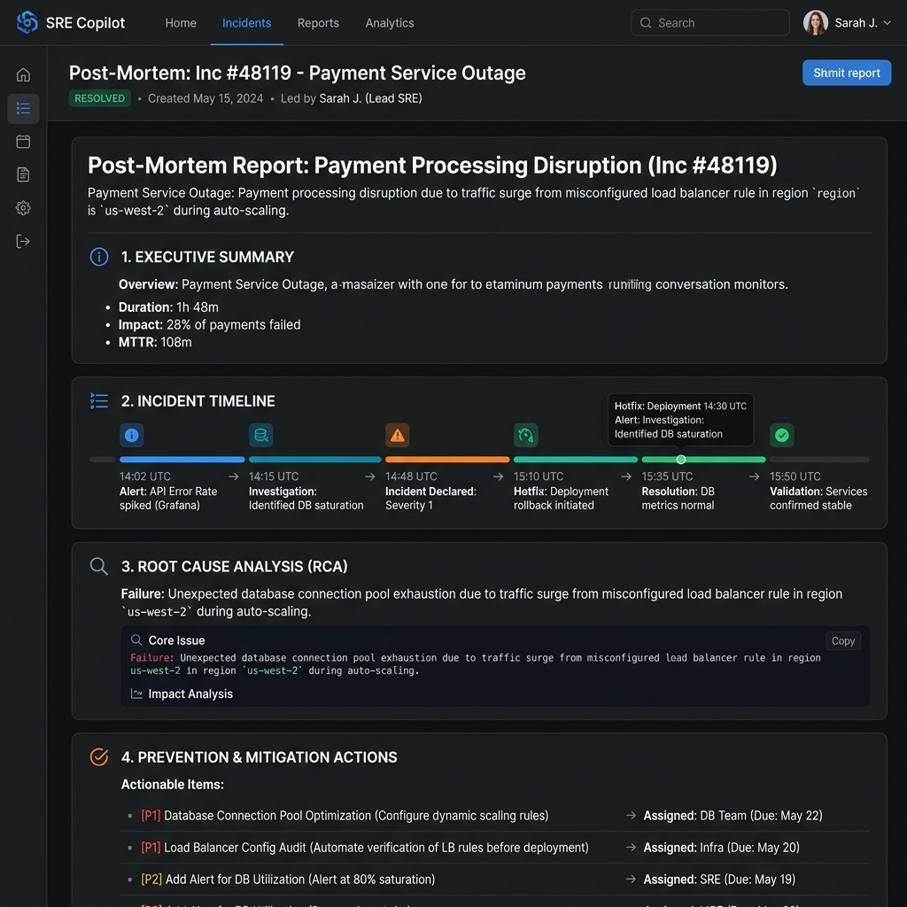

# AI SRE Copilot

<p align="center">
  
</p>

<p align="center">
  
</p>

<p align="center">
  <strong>An Autonomous Cooperative Multi-Agent Incident Response & SRE Observability Mission Control</strong>
</p>

<p align="center">
  <a href="https://github.com/Sanjeev12588/ai-sre-copilot/actions/workflows/ci.yml">
    
  </a>
  
  
  
  
  
  
  
</p>

---

## Product Vision
AI SRE Copilot provides engineering teams with an autonomous, cognitive control center that ingests alerts, triages outages, analyzes system log streams, deduces root causes, triggers mitigations, and documents post-mortems in minutes. 

### Core Value Proposition
- **Drastically Lower MTTR**: Shrinks system outage resolution from an average of 43 minutes to under 90 seconds.
- **Autonomous Investigation**: Replaces fragile automation rules with cooperative multi-agent SRE logic.
- **SRE Command Center**: A glassmorphism real-time mission control interface visualizing topology, agent debates, tool logs, and human authorization boundaries.
- **Protocol Isolation**: Separates reasoning models from infrastructure environments using the Model Context Protocol (MCP).

---

## AI SRE Mission Control Preview

Below is a preview of the redesigned, live SRE Observability Mission Control Dashboard:

<p align="center">
  
  <br>
  <em>AI SRE Mission Control Dashboard</em>
</p>

---

## Product Overview

Production outages are cascading and complex. During a high-severity incident, traditional static automation scripts fail because they cannot adapt to unexpected infrastructure states. Humans are slow, struggle with alert fatigue, and are forced to search millions of log lines under stress.

**AI SRE Copilot** solves this by establishing a team of **8 specialized SRE agents** coordinate dynamically by a central orchestrator. Built using **Google's Agent Development Kit (ADK)** and powered by **Gemini**, each agent holds a restricted scope, system instructions, and tool access boundary. Infrastructure tasks—like reading metrics, querying logs, and executing scripts—are handled over a secure JSON-RPC interface using **Model Context Protocol (MCP)** servers, guaranteeing strict sandboxing.

---

## How It Works

The platform coordinates incident investigations through an structured pipeline:

```text
 Alert Ingestion
       ↓
 Intake validation (Anti-injection checks)
       ↓
 Triage Agent (Severity categorisation P0/P1/P2)
       ↓
 Log Analyzer (Log stream query via Monitoring MCP)
       ↓
 Root Cause Agent (Hypothesis testing and debate logic)
       ↓
 Evaluator Agent (Health assertions)
       ↓
 Recovery Planner (Playbook proposal)
       ↓
 SRE Human Authorization (Approval gate)
       ↓
 Outage Resolved (Mitigation script run via Incident MCP)
       ↓
 Post-Mortem Report (Generates markdown case report)
```

This sequence is modeled in our complete [System Architecture Diagram](docs/diagrams/system_architecture.svg).

---

## Redesigned Frontend Panels & Architecture

The single-page React client has been redesigned into an enterprise-grade command center:

- **SRE Control Room Banner**: Pulsing status headers highlighting active incident details, estimated time to resolve (ETA), affected users, and current AI progress bars.
- **Agent Collaboration Canvas**: Visualizes the agent hierarchy as a connected node graph. Animated particle pulses travel between nodes to indicate message relays.
- **SRE Heat Map**: Glowing telemetry statuses check (`PULSING RED` during outages, `WARN` during degradation, `OK` for healthy modules) tracing checkout services.
- **Infrastructure Dependency Canvas**: Renders system topologies (`Users` $\rightarrow$ `LB` $\rightarrow$ `Gateway` $\rightarrow$ `checkout-api` $\rightarrow$ `payment-api` $\rightarrow$ `redis-cache` $\rightarrow$ `postgres`) showing blast-radius metrics.
- **AI Agent Debate Log**: Live streaming chat log depicting argumentative reasoning between the Root Cause Agent and the Evaluator Agent.
- **Detailed MCP Servers Registry**: Telemetry grids listing server latency metrics (ms), request volumes, and active allowed tools (`query_logs()`, `trigger_restart()`).
- **AI Memory Cache**: Reuses resolution paths from historically resolved cases (e.g. `INC-1842: 92% similarity`).
- **Mitigation Control Gate**: Human-in-the-loop authorization prompt displaying action details and risk assessment before running playbooks.
- **Post-Mortem Tabbed View**: Tab selectors for Executive Summary, Chronological Timeline, Root Cause verification, and Mitigation Actions.
- **Replay Movie Player**: Controls allowing speed adjustments (`1x / 2x / 4x`), pause/resume, and chronological jumps.

---

## UI Screenshots Gallery

### 1. Observability Dashboard
Renders simulated SRE impact metrics, security status widgets, operational counts, and simulation cards.
<p align="center">
  
</p>

### 2. Incident Detail Workspace
Command center mapping multi-agent canvasses, topologies, logs, debate logs, and replay options.
<p align="center">
  
</p>

### 3. Agent Collaboration Canvas & Canvas Particles
Visual SVG graph detailing multi-agent connection lines and active durations.
<p align="center">
  
</p>

### 4. SRE Reasoning Timeline
Chronological, terminal-style log tracing diagnostic telemetry and logs.
<p align="center">
  
</p>

### 5. SRE Dependency Blast Radius
Dependency graph indicating error flows and propagating impact.
<p align="center">
  
</p>

### 6. MCP Tool Activity Telemetry
Tool latency, availability scores, and request log charts.
<p align="center">
  
</p>

### 7. Recovery Planner & Manual Gates
Manual authorization gate actions showing risk levels.
<p align="center">
  
</p>

### 8. Security Center Widgets
API middleware checks including injection validation and firewall logs.
<p align="center">
  
</p>

### 9. Tabbed Post-Mortem Report
Tabbed document summary of the outage resolution details.
<p align="center">
  
</p>

### 10. Diagnostics RCA Analysis
RCA summaries and metric comparisons.
<p align="center">
  
</p>

---

## Explainable AI Decisions

The platform operates with complete transparency:
* **Every decision is explainable**: All logic steps are streamed in real-time.
* **Every tool call is audited**: Tool names, latencies, and parameter checks are logged to hash-chained files.
* **Probability is transparent**: Agent confidence scores are plotted in circular SVG gauges.
* **Conflict resolution is visible**: Agent debate logs show exactly how hypotheses are rejected or accepted.

---

## Why AI SRE Copilot?

| Attribute | Traditional Runbook Automation | AI SRE Copilot |
| :--- | :--- | :--- |
| **Diagnostic Reasoning** | Static logic branches (fails on unexpected conditions) | Cognitive multi-agent hypothesis testing & debates |
| **Telemetry Context** | Basic thresholds and isolated alerts | Correlated logs, topology maps, and historical memories |
| **Remediation Action** | Manual execution or hardcoded trigger scripts | Suggested mitigation plans with human authorization gates |
| **Transparency** | Black-box execution, basic run logs | Visual agent canvas, streaming logs, and post-mortems |
| **Scalability** | High rule maintenance overhead | Single ADK coordinator spawning dynamic sub-agents |
| **Security Audits** | None | Stage-5 secure pipeline with hash-chained logs |

---

## Project Telemetry Metrics

* **ADK Agents**: 8 specialized cognitive agents
* **MCP Servers**: 2 servers (Monitoring and Incident MCP)
* **Security Pipeline Stages**: 5 layers
* **REST API Endpoints**: 7 endpoints
* **WebSocket Channels**: 1 endpoint
* **Automated Tests**: 434 tests passing successfully
* **UI Workspace Panels**: 10 active sections
* **Generated Architecture Diagrams**: 10 SVG diagrams
* **Documentation Pages**: 2 core assets

---

## Repository Structure

```text
├── .github/                  # CI configurations, PR/Issue templates, release configurations
├── backend/                  # FastAPI Gateway, SRE Agents, MCP Servers, Security Pipeline
│   ├── api/                  # REST endpoints and WebSocket stream servers
│   ├── agents/               # Google ADK agent logic
│   ├── mcp_servers/          # Decoupled MCP tool servers
│   ├── security/             # Rate limiting, injection filters, audit logging, redaction
│   └── persistence/          # JSON Case-File storage
├── frontend/                 # React SPA (Vite + TS + Custom HSL Glassmorphism CSS)
│   ├── src/components/       # UI elements (Navbar, feed logs)
│   ├── src/pages/            # Dashboard pages, detail command centers, health checks
│   └── src/css/              # Stylesheets Overhauls (mission_control.css)
├── docs/                     # Documentation diagrams, screenshots, branding assets
├── tests/                    # Pytest validation suites (unit & integration tests)
├── pyproject.toml            # Backend dependencies
└── uv.lock                   # Lockfile for reproducible Python installations
```

---

## Installation & Local Development

### Prerequisites
- Python 3.11 or higher
- Node.js 22 or higher
- A valid **Gemini API Key** (set as `GEMINI_API_KEY` in your environment)

### 1. Clone & Set Environment
```bash
git clone https://github.com/Sanjeev12588/ai-sre-copilot.git
cd ai-sre-copilot
```
Create a `.env` file in the root:
```env
GEMINI_API_KEY="your-key-here"
ENV="development"
PERSISTENCE_DIR="./data/incidents"
AUDIT_LOG_DIR="./data/audit"
```

### 2. Backend Setup (`uv` environment)
```bash
# Install uv and sync packages
uv sync
```

### 3. Frontend Setup
```bash
cd frontend
npm install
cd ..
```

---

## Running the Project

### Start Backend APIs
```bash
uv run uvicorn backend.api.main:app --host 127.0.0.1 --port 8000 --reload
```

### Start Frontend client
```bash
cd frontend
npm run dev
```
Access the dashboard at `http://localhost:5173`.

### Running Tests
Verify the installation by running the validation suite:
```bash
uv run pytest
```

---

## Future Roadmap

- **Telemetry Integrations**: Connect production-grade monitoring systems (Datadog API, Google Cloud Monitoring API).
- **Incident Escalation**: Complete PagerDuty webhook configurations.
- **Agent Engines**: Deploy Vertex AI agent runtime options.
- **Historical Learning**: Train agents on historical audit trail logs for automatic recovery suggestions.
- **Topology mapping**: Auto-discover microservice topologies from Kubernetes cluster contexts.

---

## License

This project is licensed under the MIT License. See [LICENSE](LICENSE) for details.
