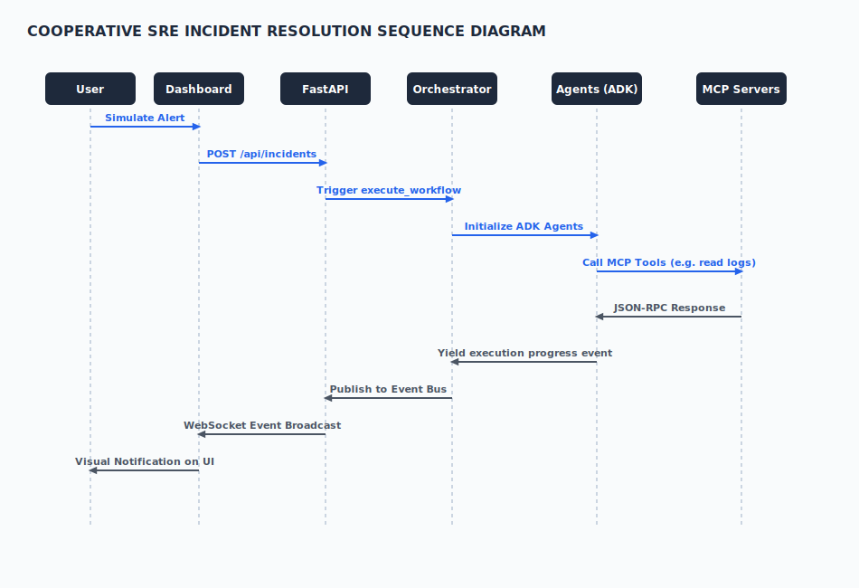

# AI SRE Copilot — Architecture & Design Deep-Dive

This document provides a comprehensive technical overview of the architecture, agents, security pipeline, data flows, and design decisions behind **AI SRE Copilot**.

---

## 1. System Architecture

The AI SRE Copilot is built using a modern decoupled design that separates the UI (React SPA), the Gateway (FastAPI API & WebSockets), and the Cognitive Reasoning Engine (Google ADK & Gemini).

### Interaction Flow
1. **User / Webhook Ingestion**: Alerts are simulated in the React Dashboard or received as JSON payloads at the FastAPI `/api/incidents` endpoint.
2. **Gateway Processing**: The request goes through the multi-stage security gateway (rate limiting, validation, injection detection).
3. **ADK Workflow Orchestration**: Once verified, the API gateway saves the initial incident state and triggers the `ADKWorkflowOrchestrator` in a background thread.
4. **Cooperative Agents**: The orchestrator spawns 8 specialized cooperative agents governed by a centralized coordinator.
5. **MCP Tool execution**: Agents call target environments through the Model Context Protocol (MCP) tool registry, executing actions safely and querying Prometheus/Docker logs.
6. **Real-time Event Bridge**: Internal event state changes are published to the Event Bus, bridged to the WebSocket Manager, and streamed in real-time to active dashboard clients.

---

## 2. Google ADK Agent Workflow

AI SRE Copilot leverages the **Google ADK** (Agent Development Kit) framework to coordinate 8 specialized cooperative agents. This is different from a single large agent prompt because each agent is given a specific scope, system instructions, and tool access boundary, leading to higher reliability and fewer hallucinations.

### The 8 Specialized SRE Agents:
1. **Intake Agent**: Receives alert payloads, parses metadata, filters out noise, and validates alert integrity.
2. **Triage Agent**: Determines the severity level (P0, P1, P2), computes system impact, and logs initial timeline logs.
3. **Log Analyzer**: Query logs and filters out stack traces, error messages, and anomalies from the target services.
4. **Root Cause Agent**: Correlates metrics, log analyses, and dependency topology to deduce the hypothesis/root cause.
5. **Evaluator Agent**: Asserts system health and validates that the service state matches expected patterns.
6. **Recovery Planner**: Formulates step-by-step mitigation playbooks (rollbacks, restarts) and publishes them to the timeline.
7. **Escalation Agent**: Routes requests to human SRE teams if severity escalates or if manual approval timeout occurs.
8. **Report Generator**: Combines reasoning histories, diagnostic outputs, and prevention advice into a standardized Markdown post-mortem.

---

## 3. Model Context Protocol (MCP) Architecture

To prevent agents from having direct, unmitigated access to system shells or database credentials, the platform abstracts all tool actions through the **Model Context Protocol (MCP)**.

### Benefits:
- **Loose Coupling**: The agents (client side) only know how to request tools like `read_logs` or `apply_rollback` over a standardized JSON-RPC channel.
- **Tool Firewall**: The registry filters, validates parameters, and logs every tool call to the audit trail before execution.
- **Provider Decoupling**: If the target monitoring changes from Prometheus to Datadog, only the MCP Server implementation changes; the cognitive agent instructions remain untouched.

---

## 4. Sequence Diagram

Below is the execution sequence for an incident, showing the interaction between HTTP endpoints, the Event Bus, and WebSockets.

---

## 5. Incident Lifecycle

Incidents traverse a strict state machine from inception to closure. State transitions are verified by lifecycle rules to prevent out-of-order execution.

### Transition States:
- `NEW` $\rightarrow$ `TRIAGED` $\rightarrow$ `INVESTIGATING` $\rightarrow$ `ROOT CAUSE IDENTIFIED` $\rightarrow$ `EVALUATING` $\rightarrow$ `MITIGATING` $\rightarrow$ `RESOLVED` $\rightarrow$ `CLOSED`.
- If a manual gate is reached, status switches to `PENDING APPROVAL`.
- If a timeout or error occurs, the Escalation Agent moves status to `ESCALATED`.

---

## 6. Security Pipeline

Security is baked into the API Gateway through a 5-Stage security pipeline that separates the untrusted client-zone from the trusted cognitive execution zone.

### Gateway Security Stages:
1. **IP Rate Limiting**: Per-IP sliding window token bucket (prevents DoS and brute-force).
2. **DTO Validation**: Schema type coercion and strict field validation via Pydantic.
3. **Prompt Injection Detection**: 3-stage checker (blacklist regex, structural heuristics, LLM classification).
4. **Audit Trail**: Every incident creation, WebSocket handshake, and tool execution is logged to a hash-chained JSONL audit file.
5. **Tool Firewall**: Checks that tool parameters (such as script names) fall within explicit lists.

---

## 7. Data Flow (Event Bus & WebSockets)

The platform streams real-time updates through a centralized Event Bus.

- Agents emit events (e.g. `IncidentEventType.STATUS_CHANGED`).
- The internal Event Bus broadcasts to the WebSocket Bridge.
- The Bridge filters out forbidden keys, redacts PII data (using `pii_redactor.py`), and sends sanitized events to active WebSockets.

---

## 8. Persistence & Storage Architecture

AI SRE Copilot uses an isolated filesystem storage system.

- **State Model**: Incident state is modeled as a unified `IncidentState` Pydantic model.
- **Store Engine**: `JsonIncidentStore` handles saving state to disk as partitioned JSON files (e.g., `data/incidents/INC-XXXXXXXX.json`).
- **Isolation**: During test suites, the store directory is isolated using pytest's temporary directory fixtures (`tmp_path`) to ensure runs are isolated and deterministic.

---

## 9. Frontend Architecture

The user interface is built as a single-page React application containing premium observability dashboards.

- **View Layer**: Renders severity summaries, incident boards, reasoning timelines, action triggers, and alert simulators.
- **Styles**: Leverages custom vanilla CSS (`mission_control.css`) implementing high-end glassmorphism and modern dark-mode layouts.
- **Transport**: Communicates with the FastAPI Gateway using REST Fetch APIs and persistent auto-reconnecting WebSockets.

---

## 10. Deployment Model

The SRE Copilot is packaged for simple local execution while remaining production-grade.

- **Frontend dev server**: Vite serves React assets on port `5173`.
- **FastAPI / Uvicorn**: Runs backend APIs and routes WebSockets on port `8000`.
- **Gemini API**: Accessed securely through the Google GenAI SDK using environment API keys.
- **MCP Servers**: Spawned as standard IO processes under the gateway.
